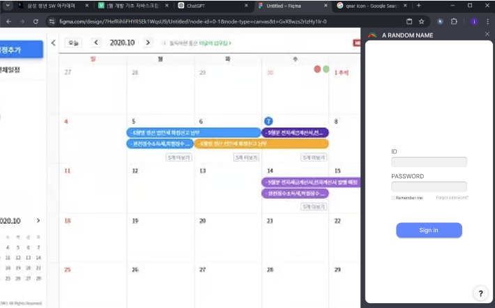
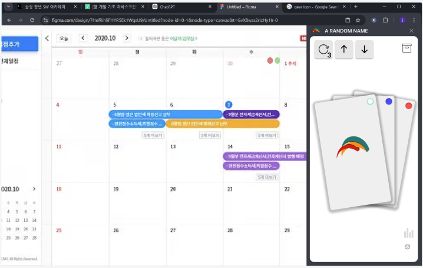
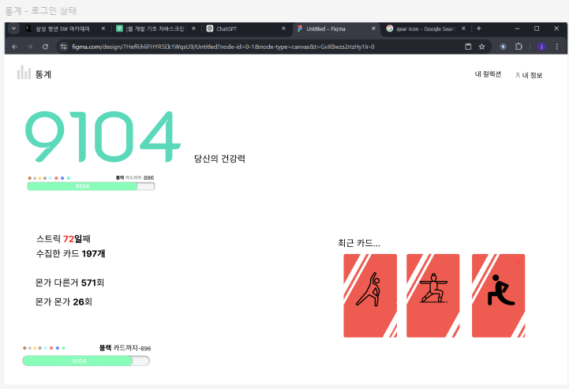
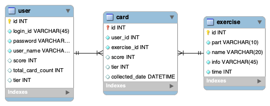
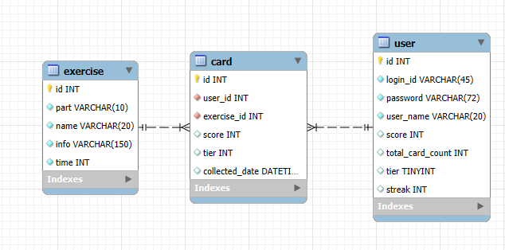

# PJT 소개
API 명세서 및 회의록 등
더 구체적인 내용은 notion을 참조해 주세요.<br>
[Final PJT 노션](https://www.notion.so/PJT-Template-babd0c39afc448c5b526e6cc2abacc39#128385f6088b812d9cdfec654edce99e)
<br>
각 팀원의 개인적인 회고는 각자의 이름으로 저장된 README를 참조해주세요.


## 주제 선정 이유

- `내가 원하는 운동 서비스`의 부재
- 건강 관리가 필요하다고 생각하지만 `지속 가능한 모티베이션`의 부재
- 근본적인 `재미`의 부재

⇒ 재밌고 간단하고 가볍게 즐길 수 있는 건강 관리 서비스가 있으면 좋겠다는 생각!

---

### 초기 아이디어
- 최근 건강 관리에 실패하며, 작업을 할 때에 스스로 건강 관리를 망각하는 경우가 많다는 것을 체감했습니다. 특히, 반장을 비롯해 이미 동기들 사이에서도 자세가 좋지 않기로 유명한 사람들이 몇몇 있습니다. <u>장기적으로 작업 효율과 함께 건강까지 챙기기 위해 리마인드를 해줄 수 있는 서비스가 있으면 좋겠다는 생각이 들어 제안하게 되었습니다.</u>
- 서비스의 핵심은 간단합니다.
    - 사무직이나 개발자 등의 직업군이 컴퓨터를 활용해 장기간 앉아서 작업을 하고 있을 때, 업무에 방해되지 않는 선에서 1시간에 1번 꼴로 돌발 건강 미션을 제공하는 것입니다. 내용은 `잠깐 자리에서 일어나 15초 동안 기지개 펴기`, `화장실에 가서 세수하고 오기`, `어깨 통통 허리 통통 눈 통통 두드려보기` 등 직장이나 학교에서도 실천할 수 있는 아주 간단한 것들로 구성하면 좋을 것 같습니다.
    - 이렇게 단순한 로직이지만, 추가적으로 확장하자면 `반려동물 유무`, `현재 위치`, `시간대` 등의 정보를 추가적으로 저장해 사용자에게 맞춤형으로 미션을 추천해줄 수 있을 것입니다. 이는 시간 내에 구현하기에 힘들 수도 있기에 우선은 후순위로 미루어두었습니다.
    - 결과적으로 이를 직접 활용해 2학기에는 건강하게 SSAFY를 다니는 것이 목표입니다. 2천만원 아끼자..!!

- 이에 대한 팀원 피드백:<br>
    a. **지운**: 아이디어가 간단한 편이라 우리가 배운 것을 최대로 활용할 수 있을지 모르겠다. PJT를 통해서 배운 걸 숙달하는 것도 중요한 기회인데 이 점에서 효과적일까?
    <br>
    &rarr; **홍균**: 핵심 기능이 간단해도 확장 가능한 범위가 넓기 때문에 부가 기능 부분에서 충분히 활용할 수 있을 것이다. 예를 들면, 유저 데이터에 따라 개인화된 퀘스트를 제공한다면 User 데이터에 들어가는 속성들이 많아질 것이고, AI의 Open API도 사용해볼 수도 있을 것이다. 아니면, 유저 편의성을 위해 추가적인 기능을 생각해볼 수도 있을 것이다. <br>

    b. **지운**: 확실히 광범위하기 때문에 방향을 잘 정하면 좋을 것 같기도 하다. 캐시워크처럼 일정 시간 간격으로 랜덤한 범위 내에서 퀘스트를 낸다거나도 가능할 것 같다. 특히, 휴대폰 어플리케이션 서비스를 가정했을 때, 휴대폰의 위치를 감지해 퀘스트 달성 등을 감지하고, 달성했을 시 리워드를 제공하는 방향으로 할 수 있을 거 같다.
    <br>
    &rarr; **홍균**: 퀘스트의 범위가 광범위 하고, 아주 간단하게 이룰 수 있는 것들도 많을 것이라 예상해서 개발자가 직접 달성을 체크하는 부분보다는 유저가 직접 체크하는 게 나을 것 같다. 무디도  유저가 직접 퀘스트 완료를 누르는 방식으로 구현되어 있다. 아무래도 건강 관리가 중점이다보니, 퀘스트 달성에 대한 리워드가 약하더라도 자신이 직접 하나씩 해나간다는 정서적인 구조를 만드는 게 더 나을 것 같다.

이 초기 아이디어에 맞춘 프로토타입은 아래 사진과 같습니다.


쉽고 가볍고 간단하게 즐길 수 있는 건강 관리</u>'** 이기에 이에 맞게 <u>**Gamification**</u>을 접목하자는 아이디어가 제시되었습니다.
이지운 팀장의 제안으로 서비스 노선을 변경하여 카드를 수집하는 재미를 추구하는 방향으로 선정하였습니다. 
조홍균 팀원의 제안으로 접근성을 높이기 위해 <u>**Chrome Extention**</u>을 플랫폼으로 사용해 개발하기로 결정했습니다. 기본적으로 웹 기반이기 때문에 Compact한 느낌을 유지하면서도 기존에 배운 내용들을 활용해 더 좋은 UI/UX를 제공할 수 있을 것이라 판단했습니다.

 프로토타입은 아래 사진과 같습니다.





### 상세 내용
1. **유저 페르소나**: 
    - 김싸피(28세) SSAFY에서 웹 개발을 배우는 비전공 자바반 열혈 학생. 
    - 한 번 앉아서 업무를 시작하면 자세와 같은 부분에서 신경쓰지 못함. 쉬는 시간이 되면 엎드려 자기도 함
    - 집에서 컴퓨터 앞에 앉아서 나머지 공부를 하거나 PC 게임을 즐겨함
2. **페인 포인트**: 하루의 대부분을 앉아서 컴퓨터를 통한 작업과 학업에 집중하느라 눈, 목, 허리, 손목 등 건강을 챙기지 못하는 문제
3. **저니 맵**:<br>
    a. 아침 지옥철을 통해 와서 이미 체력이 너덜너덜함<br>
    b. 부랴부랴 입실 체크하고 9시 강의 바로 스타트<br>
    c. 너무 졸려서 중간 쉬는 시간에 엎드려 잠<br>
    d. 점심 먹고 커피 한 잔 사러 가벼운 산책 정도<br>
    e. 오후 시간 쭉 앉아서 컴퓨터로 작업<br>
    f. 퇴실 후 저녁 지옥철로 다시 한 번 바닥난 체력에 마지막 일격을 가함<br>
    g. 저녁 식사 후 컴퓨터로 나머지 작업 및 취미를 즐기고 싶지만 눈과 허리가 피로해 오래 하지 못함<br>
    h. 취침. 허리 통증으로 인해 숙면을 취하지 못함<br>
>아 내일은 진짜 건강 관리 해야지... 스트레칭도 하고...
4. **벤치 마킹 서비스**:
    - **무디(moodee)**: 퀘스트를 통해 감정을 다루고 기록, 분석할 수 있는 어플리케이션. 기본적인 서비스 로직 벤치마킹
    - **크롬 확장 프로그램들**: 크롬 확장 프로그램이 어디까지 권한을 가지고 접근할 수 있는지, UI/UX 적인 부분에서 사용감이 어떤지 벤치마킹
    - **solved.ac(솔브닥)**: 랭킹 및 포인트 시스템 벤치마킹
5. 프로젝트 환경
    - BackEnd Server: **Spring ← STS로 개발**
        - 실제 개발 기간이 짧았기 때문에 IntelliJ로 Spring Boot 프레임워크를 적용한 프로젝트를 생성하는 과정을 고민하고 새로 배우는 것이 시간적 리스크가 크다고 생각해 익숙한 STS를 이용하였습니다.<br>
        &rarr; 마무리하며 돌아보았을 때, IntelliJ의 코드 서포트 능력이 압도적으로 뛰어난 것을 생각해 보았을 때, 조금의 시간을 들이더라도 IntelliJ로 개발을 하는 것이 더 효율적이지 않았나 하는 생각이 듭니다. 이는 IntelliJ를 통해 개발을 진행하며 굉장히 빠른 속도로 작업을 하던 동기를 보았기 때문에 더더욱 와닿았습니다.
    - FrontEnd Sever: **Vue.js**
    - DB: **MySQL**
        - 마찬가지로, 실제 개발 기간이 짧아 현업에서 많이 사용하는 관계형 DB인 Oracle을 사용하는 방법에 대해 배우는 시간적 리스크가 크다고 생각해 익숙한 MySQL을 사용하였습니다.
    - Libraries
        - FE
            - Axios
            - Vue Router
        - BE
            - spring boot dev tools
            - mybatis
            - Spring AI
            - Spring Security
    - Project Management: **Jira**, **Notion**
    - Online Contact: **Matter Most**


### ERD
1안<br>

<br>
수정본<br>

<br>
&rarr; 변경점:<br>
    - info 45자 제한에서 150자 제한으로 변경(Gen AI 사용에 따른 증가)<br>
    - user 테이블에 streak column 추가<br>

### Git Convention
```
Feat
새로운 기능을 추가할 경우

Merge
PR을 통해 Branch끼리 Commit 내역을 Merge 했을 경우

Fix
버그를 고친 경우

Design
CSS 등 사용자 UI 디자인 변경

!BREAKING CHANGE
커다란 API 변경의 경우

Style
코드 포맷 변경, 세미 콜론 누락, 코드 수정이 없는 경우

Refactor
프로덕션 코드 리팩토링

Docs
문서를 수정한 경우

Chore
빌드 태스트 업데이트, 패키지 매니저를 설정하는 경우(프로덕션 코드 변경 X)

Rename
파일 혹은 폴더명을 수정하거나 옮기는 작업만인 경우

Remove
파일을 삭제하는 작업만 수행한 경우

(Etc)
그 외 부수적인 수정
필요한 주석 추가 및 변경 등...
```
출처:
[https://overcome-the-limits.tistory.com/entry/협업-협업을-위한-기본적인-git-커밋컨벤션-설정하기](https://overcome-the-limits.tistory.com/entry/%ED%98%91%EC%97%85-%ED%98%91%EC%97%85%EC%9D%84-%EC%9C%84%ED%95%9C-%EA%B8%B0%EB%B3%B8%EC%A0%81%EC%9D%B8-git-%EC%BB%A4%EB%B0%8B%EC%BB%A8%EB%B2%A4%EC%85%98-%EC%84%A4%EC%A0%95%ED%95%98%EA%B8%B0)
